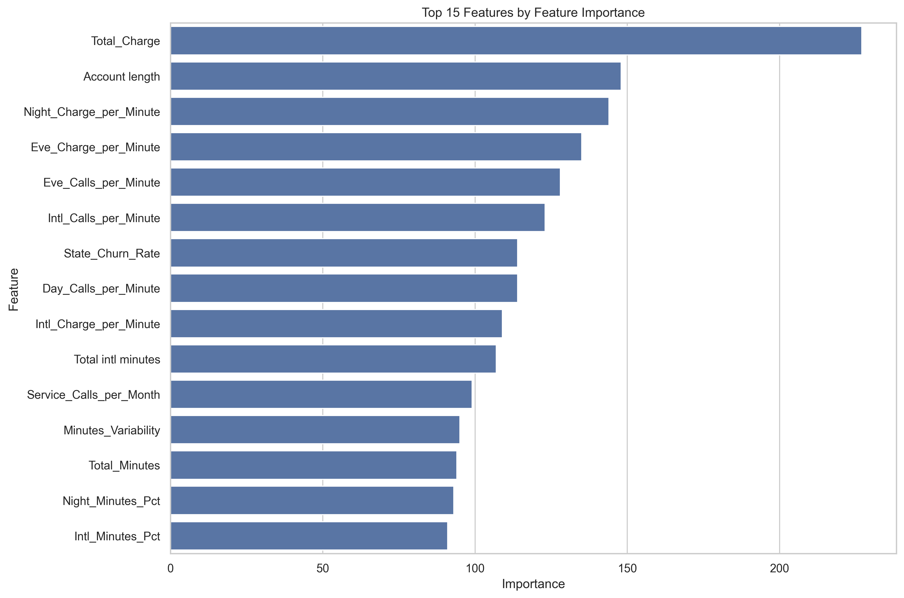
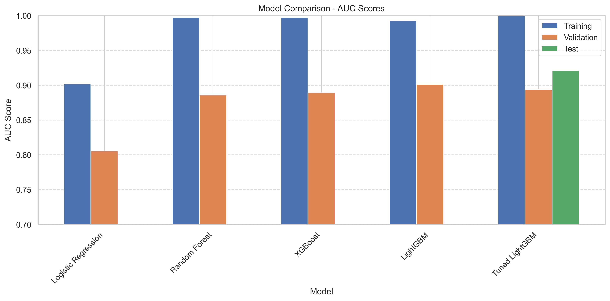
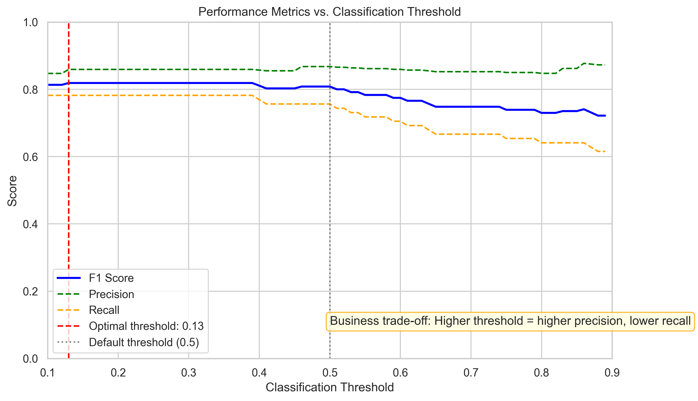
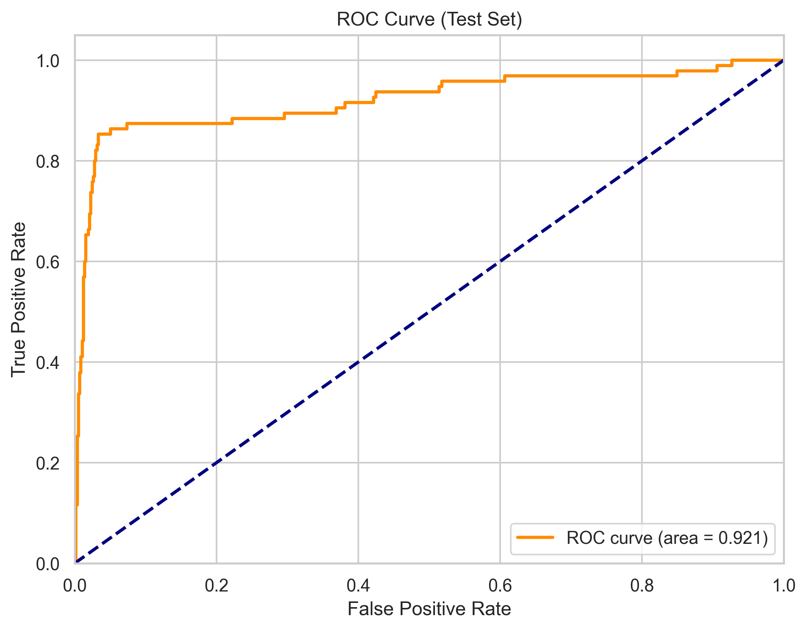
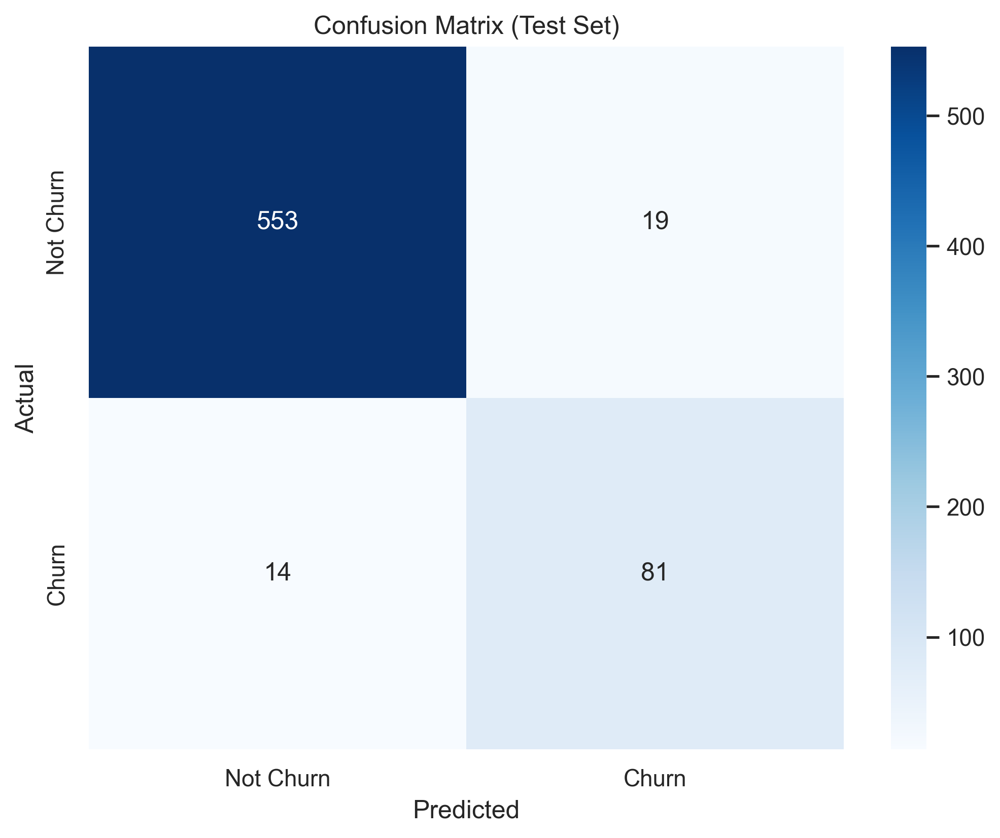

# Customer Churn Prediction

## 📊 Project Overview

This project leverages machine learning to predict customer churn in a telecommunications company. By identifying customers at high risk of churning, companies can proactively implement targeted retention strategies before customers leave, resulting in significant revenue protection.

### Problem Statement

Customer churn is a critical business challenge in the telecommunications industry, where acquiring a new customer can cost 5-25 times more than retaining an existing one. This project aims to:

1. Build a high-performance predictive model to identify at-risk customers
2. Uncover key factors driving customer churn
3. Provide actionable insights for targeted retention strategies

## 🔍 Key Findings & Business Impact

Our model successfully identifies **85.26% of customers who will churn** with a precision of **81.0%**, meaning only 19% of retention efforts would be "wasted" on customers unlikely to leave.

### Top Churn Predictors

1. **Total_Charge** (Importance: 227.0) - Billing amounts strongly correlate with churn decisions
2. **Account length** (Importance: 148.0) - Contrary to expectations, longer-tenured customers aren't automatically more loyal
3. **Night_Charge_per_Minute** (Importance: 144.0) - Off-peak pricing sensitivity is significant
4. **Eve_Charge_per_Minute** (Importance: 135.0) - Evening rate plans heavily influence retention
5. **International calling patterns** (Multiple features) - Usage patterns for international service strongly predict churn



### Business Recommendations

1. **Implement Tiered Pricing Plans**
   - Develop pricing tiers strategically positioned below detected churn thresholds
   - Create automatic discount triggers for high-risk accounts

2. **Launch Tenure-Based Loyalty Programs**
   - Activate special benefits at months 6, 12, and 18 to counteract the account-length paradox
   - Institute proactive account reviews at months 9 and 15

3. **Restructure Off-Peak Pricing**
   - Create "Night Owl" and "Evening Advantage" packages for heavy off-peak users
   - Ensure night/evening rates are demonstrably more competitive than major competitors

4. **Deploy Geographic Targeting**
   - Implement region-specific retention offers for the 5 highest-churn states
   - Assign competitive intelligence teams to analyze markets with elevated churn rates

5. **Optimize International Plans**
   - Implement predictive triggers when international usage patterns change by ±20%
   - Develop automatic plan optimization suggestions for international callers

## 🔬 Methodology

### 1. Exploratory Data Analysis
- Identified class imbalance (~15% churn rate)
- Discovered strong correlation between minutes and charges across time periods
- Found significant impact of customer service calls and international plan on churn

### 2. Feature Engineering
- Created usage ratio metrics across different time periods
- Developed call density features (calls per minute)
- Generated variability measures to detect irregular usage patterns
- Used target encoding for high-cardinality variables like state

### 3. Model Building & Comparison
Evaluated multiple classification algorithms with appropriate handling of class imbalance:

| Model | Validation AUC | Test AUC |
|-------|---------------|----------|
| Logistic Regression | 0.805 | - |
| Random Forest | 0.886 | - |
| XGBoost | 0.889 | - |
| LightGBM | 0.901 | - |
| Tuned LightGBM | 0.894 | 0.921 |



### 4. Hyperparameter Tuning & Threshold Optimization
- Performed randomized search CV for optimal hyperparameters
- Used an adjusted classification threshold (0.13) to maximize F1 score
- Balanced precision and recall for business objectives



### 5. Comprehensive Evaluation
- Generated standard classification metrics
- Created business-focused metrics translating to revenue impact
- Performed detailed error analysis on misclassifications

## 📈 Results

The final tuned LightGBM model achieved:

- **Accuracy**: 95.05%
- **Precision**: 81.00%
- **Recall**: 85.26%
- **F1 Score**: 83.08%
- **ROC AUC**: 0.921
- **Confusion Matrix**:
  - True Positives: 81 (correctly identified churners)
  - False Positives: 19 (incorrectly flagged as churners)
  - True Negatives: 553 (correctly identified non-churners)
  - False Negatives: 14 (missed churners)




## 🛠️ Technologies Used

- **Python 3.9**
- **pandas, numpy** - Data manipulation and analysis
- **scikit-learn** - ML models, preprocessing, evaluation
- **XGBoost, LightGBM** - Advanced gradient boosting implementations
- **matplotlib, seaborn** - Data visualization
- **SHAP** - Model interpretability

## 📁 Project Structure

```
Customer-Churn-Prediction/
├── data/
│   ├── raw/                    # Original data
│   └── processed/              # Cleaned and engineered features
├── models/                     # Saved model files
├── notebooks/
│   ├── 1_Exploratory_Data_Analysis.ipynb
│   ├── 2_Feature_Engineering.ipynb
│   └── 3_Model_Building.ipynb
├── reports/                    # Generated reports and visuals
├── README.md                   # Project description (this file)
└── requirements.txt            # Dependencies
```

## 🚀 Installation and Usage

### Installation

```bash
# Clone the repository
git clone https://github.com/maze291/Customer-Churn-Prediction.git

# Navigate to the project directory
cd Customer-Churn-Prediction

# Create and activate a virtual environment (optional but recommended)
python -m venv venv
source venv/bin/activate  # On Windows: venv\Scripts\activate

# Install dependencies
pip install -r requirements.txt
```

### Usage

To run the notebooks locally:

```bash
jupyter notebook notebooks/
```

To use the trained model for prediction:

```python
# Load the saved model
with open('models/churn_model_20250310_202523.pkl', 'rb') as f:
    model_data = pickle.load(f)
    
model = model_data['model']
threshold = model_data['threshold']
feature_names = model_data['feature_names']

# Prepare customer data
new_customer = {
    'Total_Charge': 56.78,
    'Account length': 125,
    'Night_Charge_per_Minute': 0.04,
    # ... include all required features ...
}

# Predict churn probability
churn_prob = predict_churn_probability(new_customer, model, feature_names)
churn_predicted = churn_prob >= threshold

print(f"Churn probability: {churn_prob[0]:.2f}")
print(f"Churn prediction: {'Yes' if churn_predicted[0] else 'No'}")
```

## 📝 Future Improvements

1. **Deployment**: Create a Flask/FastAPI endpoint for real-time predictions
2. **Model Monitoring**: Implement drift detection to identify when model performance degrades
3. **Ensemble Methods**: Explore model ensembling for further performance gains
4. **Customer Segmentation**: Incorporate pre-churn segmentation for more targeted retention strategies
5. **Time Series Analysis**: Add temporal features to capture trend and seasonality in usage patterns

## 🧑‍💻 About the Author

Connect with me on [LinkedIn](https://www.linkedin.com/in/mohammed-abdul-azeem-4379a630a/) or check out my other projects on [GitHub](https://github.com/maze291/).

## 📄 License

This project is licensed under the MIT License - see the LICENSE file for details.